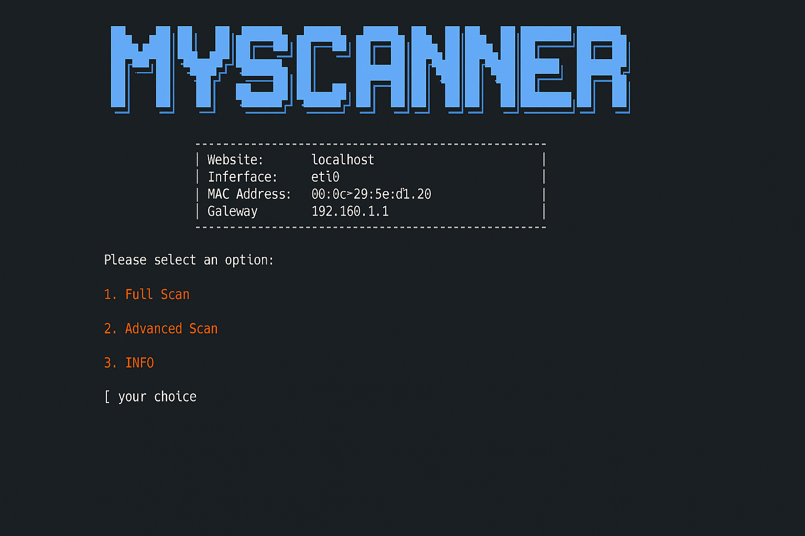

# Myscanner

**Myscanner** is a terminal-based web vulnerability scanner built to perform both full and advanced scans.  
Simple, fast, and effective for pentesters and developers.

## 🖼️ Screenshot



## 🛠️ Features

- ✅ Full scan for common vulnerabilities
- ⚙️ Advanced scan with custom options
- 🧠 Easy-to-use terminal interface

## 🚀 Getting Started

1. Clone the repository:
   ```bash
   git clone https://github.com/ayoubamg/myscanner.git
   cd myscanner
   ```

2. Run the tool:
   ```bash
   python3 scanner.py
   ```

## 📄 License

MIT License – feel free to use, modify, and share.
